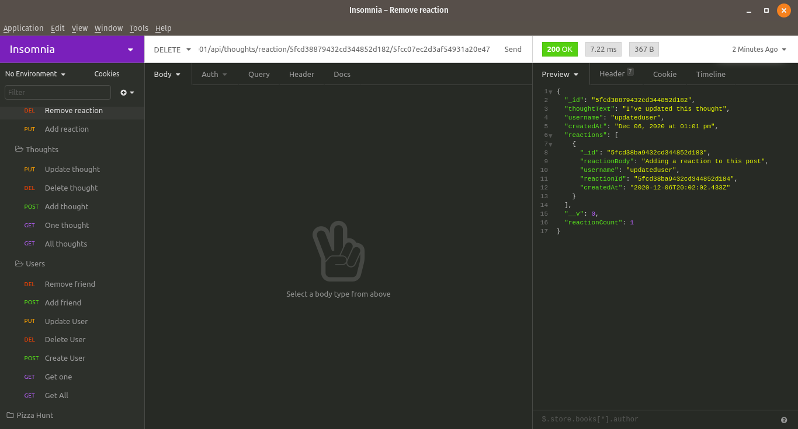

# Thought Bubbles

## Description

Thought Bubbles is a backend RESTful API for a social media website. This program has all the base functions of a social media website such as: user management, thought (comment) management, and reaction (replies) management. With Thought Bubbles, you can do the following:

- Create, update, and delete users
- View multiple or a single user
- Add or delete friend associations
- Create, update, and delete thoughts
- Add or delete reactions to thoughts

## Table of Contents

- [Installation](#installation)
- [Usage](#usage)
- [Credits](#Credits)
- [Questions](#questions)



## Installation

1. Prerequisite: MongoDB is already installed and configured
2. Clone the repository then run `npm install package.json` to make sure all dependencies are gotten.
3. Navigate to the DB folder.
4. Start the server by running `node server.js` or by using `nodemon`

## Usage

Once the server is running, you can use the following routes to interact with the database:

### User routes

```
Get all users or create a user
localhost:3001/api/users

Get a user by single ID, update a user, or delete a user
localhost:3001/api/users/:userId

Add or remove friends
localhost:3001/api/users/:userId/friends/:friendId
```

### Thought routes

```
Get all thoughts
localhost:3001/api/thoughts

Update thought and get single thought
localhost:3001/api/thoughts/:thoughtId

Add thought to user
localhost:3001/api/thoughts/:userId

Remove thought
localhost:3001/api/thoughts/:userId/:thoughtId

Add new reaction
localhost:3001/api/thoughts/reaction/:thoughtId

Remove reaction
localhost:3001/reaction/:thoughtId/:reactionId
```

## Credits

http://github.com/mondrovic

## Inquiries

Any questions or inquiries can go to mondrovic1@gmail.com
Matthew Ondrovic
https://githbub.com/mondrovic
